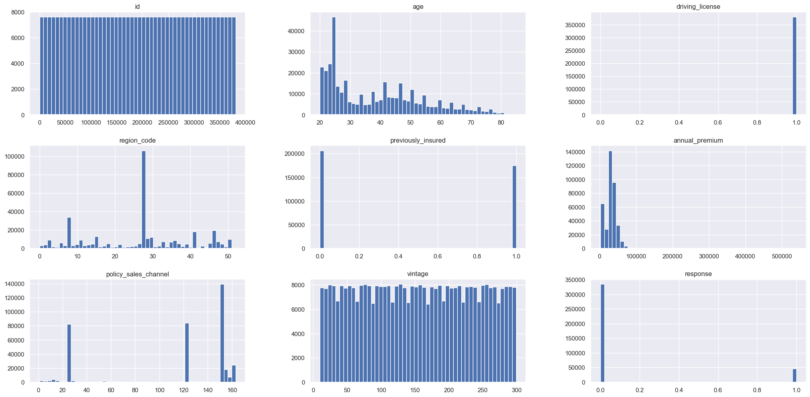
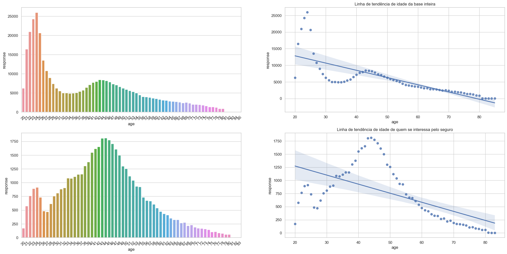
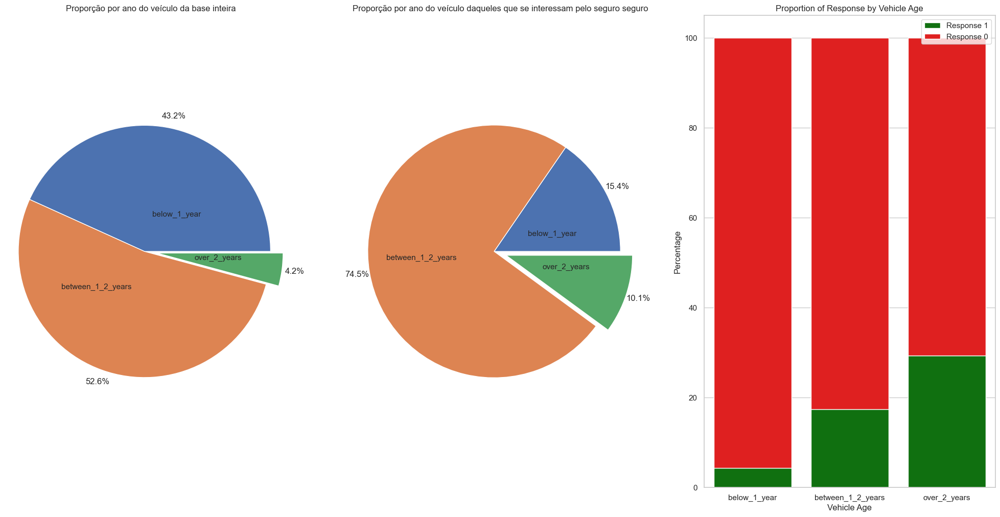
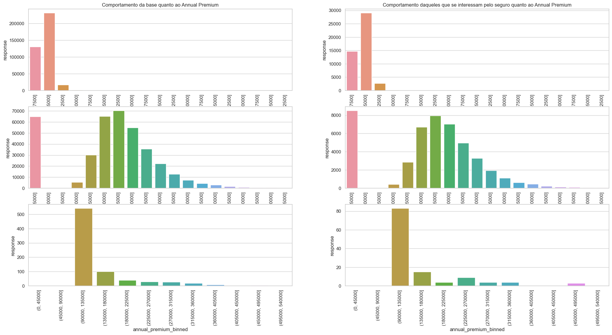
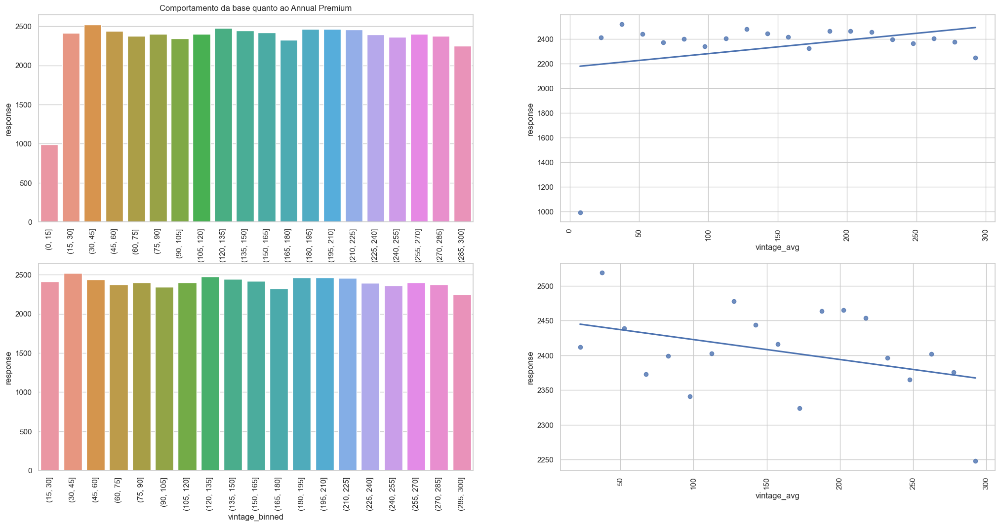
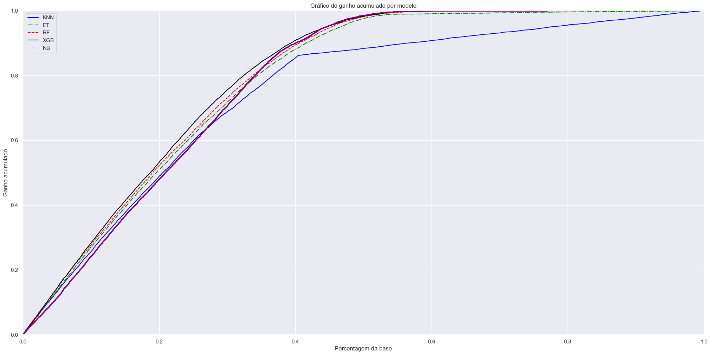
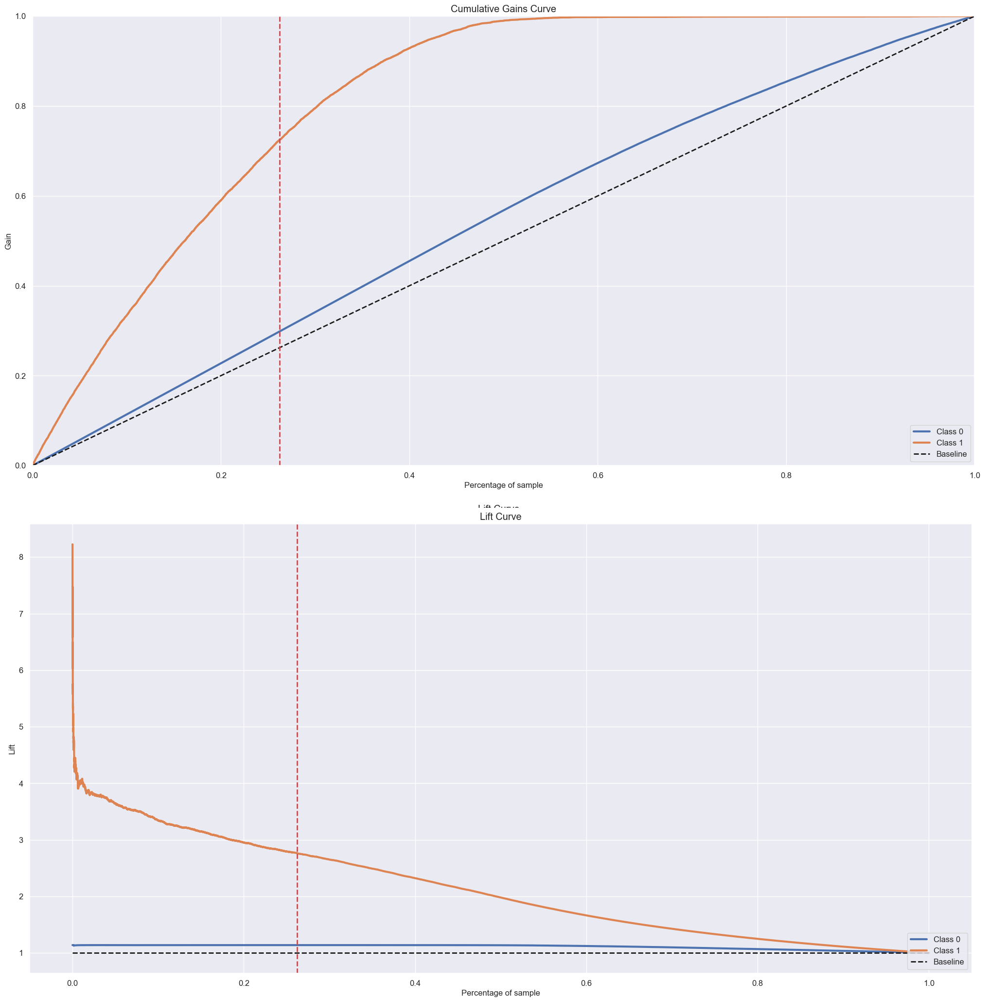
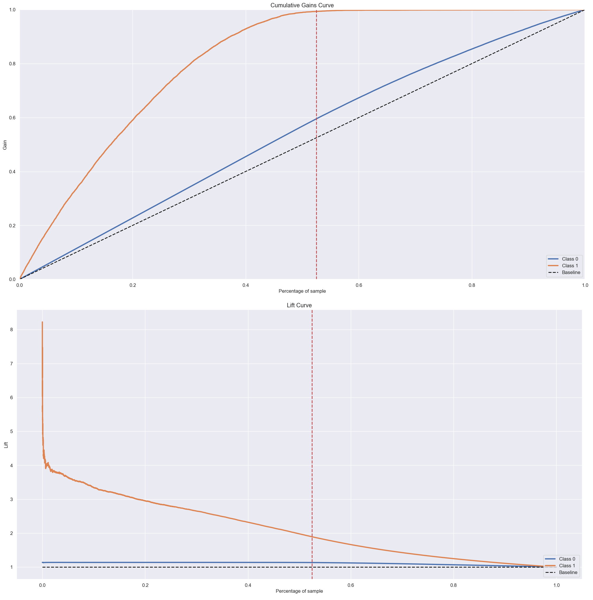
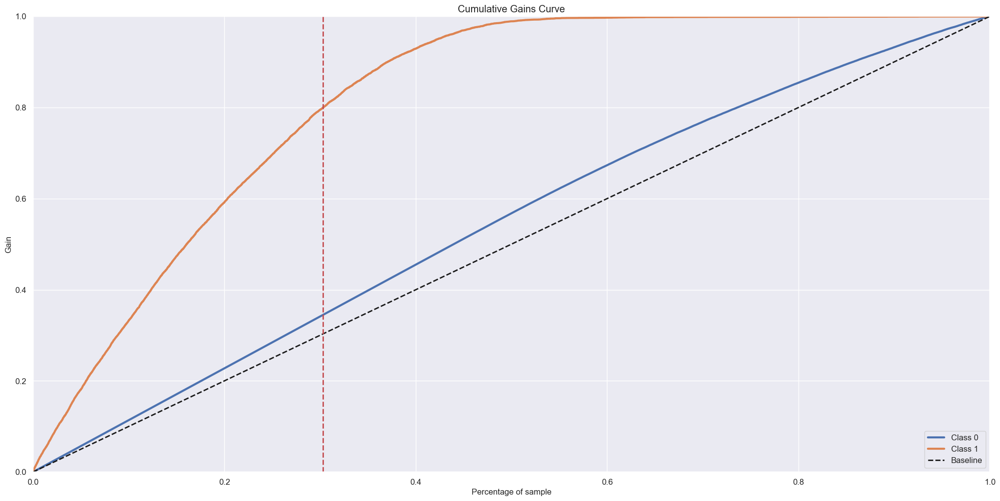

# Vou fazer o README AINDA - Usando como base o abaixo

# Health Insurance Cross Sell Prediction

# Introdução 
Este é um projeto end-to-end de Data Science de um modelo de Classificação, cujo objetivo é oferecer a seus clientes de planos de saúde um novo produto: o seguro de automóveis. O principal objetivo do projeto é classificar os clientes com maior probabilidade de compra deste novo produto, de forma a otimizar a eficácia da equipa de vendas, fazendo apenas contatos com clientes com maior probabilidade de compra. As previsões podem ser acessadas pelo usuário através de uma planilha do Google Sheets, que ao executar o comando, ordena os cliente através da sua propensão de compra.

Este repositório contém a solução para a resolução de uma problema do Kaggle: [https://www.kaggle.com/datasets/anmolkumar/health-insurance-cross-sell-prediction](https://www.kaggle.com/datasets/anmolkumar/health-insurance-cross-sell-prediction)

Esse projeto faz parte da "Comunidade DS", que é um ambiente de estudo que promove o aprendizado, execução, e discussão de projetos de Data Science.

### Plano de Desenvolvimento do Projeto de Data Science
Esse projeto foi desenvolvido seguindo o método CRISP-DS(Cross-Industry Standard Process - Data Science). Essa é uma metodologia capaz de transformar os dados da empresa em conhecimento e informações que auxiliam na tomada de decisão. A metodologia CRISP-DM define o ciclo de vida do projeto, dividindo-as nas seguintes etapas:
* Entendimento do Problema de Negócio 
* Coleção dos Dados
* Limpeza de Dados
* Análise Exploratória dos Dados
* Preparação dos Dados
* Modelos de Machine Learning, Cross-Validation e Fine-Tuning.
* Avaliação dos Resultados do Modelo e Tradução para Negócio.
* Modelo em Produção

### Planejamento
* [1. Descrição e Problema de Negócio](#1-descrição-e-problema-de-negócio)
* [2. Base de Dados e Premissas de Negócio](#2-base-de-dados-e-premissas-de-negócio)
* [3. Estratégia de Solução](#3-estratégia-de-solução)
* [4. Exploration Data Analysis](#4-exploration-data-analysis)
* [5. Seleção do Modelo de Machine Learning](#5-seleção-do-modelo-de-machine-learning)
* [6. Performance do Modelo](#6-performance-do-modelo)
* [7. Resultados de Negócio](#7-resultados-de-negócio)
* [8. Modelo em Produção](#8-modelo-em-produção)
* [9. Conclusão](#9-conclusão)
* [10. Aprendizados e Trabalhos Futuros](#10-aprendizados-e-trabalhos-futuros)

# 1. Descrição e Problema de Negócio

### 1.1 Descrição
Uma empresa que oferece planos de saúde para seus clientes. A equipe do produto está analisando a possibilidade de oferecer um novo produto ao cliente segurador: o seguro de automóveis. À semelhança do seguro de saúde, os clientes deste novo plano de seguro automóvel têm de pagar um valor anual à seguradora para obter um valor segurado pela empresa, destinado aos custos de um eventual acidente ou danos na viatura.

### 1.2 Problema de Negócio
A empresa pesquisou 381.110 clientes sobre seu interesse em adquirir o novo produto, o seguro de automóveis, e quer usar esses dados para ordenar outros 127.038 clientes que não responderam a pesquisa quanto a sua propensão em aderir ao novo seguro ou não. Atualmente a lista é ordenada por um modelo aleatório, com ordenação com idade ou tempo de seguro.

Nesse contexto, você foi contratado como Consultor Data Scientist para construir um modelo que prevê se o cliente teria interesse ou não em adquirir o novo seguro de automóvel. Com sua solução, a equipe de vendas espera priorizar os clientes com maior propensão à obtenção do novo produto e, assim, otimizar a campanha fazendo contatos apenas com clientes com maior probabilidade de compra.

Como resultado de sua consultoria, você precisará entregar um relatório contendo algumas análises e respostas para as seguintes perguntas:

**- Principais Insights dos atributos mais relevantes dos clientes interessados em adquirir um seguro de automóvel.**

**- Qual é a porcentagem de interesse dos clientes em adquirir um seguro de automóvel que a equipe de vendas conseguirá atingir com 20.000 ligações?**

**- Qual é a porcentagem de interesse dos clientes em adquirir um seguro de automóvel que a equipe de vendas conseguirá atingir com 40.000 ligações?**

**- Quantas ligações a equipe de vendas precisa para atingir 80% dos clientes interessados em contratar um seguro de automóvel?**

# 2. Base de Dados e Premissas de Negócio
## 2.1 Base de Dados
O conjunto de dados total possui as informações referentes 381.110 clientes e possuem os seguintes atributos:
| **Atributos** |  **Descrição**  |
| ------------------- | ------------------- |
| id | ID único que diferencia cada cliente |
| Gender |  Gênero do cliente |
| Age|  Idade do cliente |
| Driving_License |  O cliente não possui Permissão para Dirigir, 1 : O cliente já possui Permissão para Dirigir |
| Region_Code |  Código exclusivo da região do cliente |
| Previously_Insured |  Cliente já tem Seguro de Automóvel, 0 : Cliente não tem Seguro de Automóvel |
| Vehicle_Age |  Idade do Veículo - Menos que 1 ano, entre 1 e 2 anos, mais que 2 anos |
| Vehicle_Damage |  O cliente teve seu veículo danificado no passado. 0 : O cliente não teve seu veículo danificado no passado. |
| Annual_Premium |  O valor que o cliente precisa pagar de segeuro de saúde por ano |
| Policy_Sales_Channel |  Código anônimo para o canal de contato com o cliente, ou seja, por correio, por telefone, pessoalmente, etc. |
| Vintage |  Número de dias, o cliente foi associado à empresa |
| Response |  O cliente está interessado, 0: O cliente não está interessado |

## 2.2 Premissas de Negócio
Nenhuma coluna foi excluida na análise do projeto. Cada linha representa um cliente e cada coluna contém alguns atributos que descrevem esse cliente, além de sua resposta à pesquisa, na qual ele mencionou seu interesse ou não em adquirir o novo produto de seguro.

# 3. Estratégia de Solução
A estratégia de solução foi a seguinte:
### Passo 01. Descrição dos Dados
Nesse passo foi verificado alguns aspectos do conjunto de dados, como: nome de colunas, dimensões, tipos de dados, checagem de dados faltantes (NA), análise descritiva dos dados e quais suas variáveis categóricas.
### Passo 02. Featuring Engineering
Na featuring engineering foi derivado novos atributos(colunas) baseados nas variáveis originais, possibilitando uma melhor descrição do fenômeno daquela variável.
### Passo 03. Filtragem de Variáveis
Verificando a necessidade de filtrar o conjunto de dados com base em uma variável que não interessa ao projeto em si.
### Passo 04. Análise Exploratória dos Dados (EDA)
Exploração dos Dados com objetivo de encontrar Insights para o melhor entendimento do Negócio. 
Foram feitas também análises univariadas, bivariadas e multivariadas, obtendo algumas propriedades estatísticas que as descrevem, e mais importante respondendo perguntas sobre o negócio.
### Passo 05. Preparação dos Dados
Sessão que trata da preparação dos dados para que os algoritmos de Machine Learning possam ser aplicados. Foram realizados alguns tipos de escala e encoding para que as variáveis categóricas se tornassem numéricas.
### Passo 06. Seleção de Variáveis do Algoritmo
A seleção dos atributos foi realizada utilizando o método de seleção de variáveis Boruta, sem muito efeito, dessa forma, foi realizado um estudo de importância das colunas, no qual os atributos mais significativos foram selecionados para que a performance do modelo fosse maximizada.
### Passo 07. Modelo de Machine Learning
Realização do treinamento dos modelos de Machine Learning . O modelo que apresentou a melhor perfomance diante a base de dados com cross-validation aplicada seguiu adiante para a hiper parametrização das variáveis daquele modelo, visando otimizar a generalização do modelo.
### Passo 08. Hyper Parameter Fine Tuning
Foi encontrado os melhores parâmetros que maximizavam o aprendizado do modelo. Esses parâmetros foram definidos com base no método de RandomSearch.
### Passo 09. Conversão do Desempenho do Modelo em Valor de Negócio
Nesse passo o desempenho do modelo foi analisado mediante uma perspectiva de negócio,e traduzido para valores de negócio.
### Passo 10. Deploy do Modelo em Produção 
Publicação do modelo em um ambiente de produção em nuvem (Render) para que fosse possível o acesso de pessoas ou serviços para consulta dos resultados e com isso melhorar a decisão de negócio da empresa.
### Passo 11. Google SpreadSheets
Foi desenvolvido um script no Google Sheets em que os dados de entrada são os atributos e informações dos clientes e o resultado desse script é uma tabela com os atributos do cliente ordenado pela sua propensão a adquirir o novo seguro de automóvel.

# 4. Exploration Data Analysis 
## 4.1 Análise Univariada
* Variáveis Numéricas: o histograma abaixo mostra como está organizada a distribuição das variáveis numéricas do nosso conjunto de dados. Mostra a contagem de cada variável numérica do dataset.

## 4.2 Análise Bivariada
### H2 - Pessoas mais velhas tem uma tendência maior de se interessarem pelo seguro.
**FALSO** Quanto maior a idade, MENOR a tendência de se interessar pelo seguro de automóveis.
* Nos gráficos da 1ª linha podemos ver que a base apresenta uma maior quantidade de clientes entre 20 e 30 anos e mostra uma linha de tendência crescente, quanto maior a idade, menos amostrar na base.
* Nos gráficos da 2ª linha podemos ver a relação da idade de clientes que aceitariam o seguro, com a predominância de clientes entre 40 e 50 anos, com uma linha de tendência decrescente, quanto maior a idade menos clientes.
* Dessa forma, entre os clientes que aceitariam o seguro há uma predominância de clientes mais velhos, contudo, a linha de tendência mostra que quanto mais idade, há menos clientes que aceitariam o seguro.
 

### H5 - Quanto mais velho o veículo, maior a chance da pessoa se interessar pelo seguro.
**VERDADEIRO** - A proproção de pessoas que se interessam pelo seguro é maior quando o veículo tem mais de 2 anos, portanto, quando mais velho o veículo, maior a chance da pessoa se interessar pelo seguro.
* No 1º gráfico observa-se que a quantidade de amostras de clientes com veículo com menos de um ano, e entre um ano e dois, são bem parecidos. A quantidade de clientes com veículos com mais d 2 anos é de 4,2%.
* Entre aqueles que se interessam pelo seguro, há uma predominância de clientes com veículos entre um e dois anos. Contudo, a proporção de veículos com mais de dois anos apresentou um crescimento considerável.
* No 3º gráfico vemos que a proporção de clientes interessados pelo seguro é maior naqueles que com veículos com mais de dois anos.

### H7 - Quanto mais a pessoa paga de Annual Premium, maior a chance dela se interessar em ter um seguro.
**FALSO** - Quanto mais a pessoa paga no Annual Premium, menos ela se interessa em adquirir o seguro.
* Na esquerda vemos os gráficos da relação da quantidade de clientes com o quanto pagam de Annual Premium.
* Na direita vemos os gráficos da relação da quantidade de clientes que se interessam pelo com o quanto pagam de Annual Premium.
* Os primeiros gráficos mostram o total de Annual Premium, os segundos dão um zoom nos que pagam menos que 100.000 e os terceiros gráficos mostram os que pagam mais que 100.000.
* A maioria do clientes pagam menos que 55.000 de Annual Premium, e quanto mais os clientes pagam, menor a quantidade deles na base e menor o interesse no seguro de automóveis.

### H8 - Quanto maior o tempo que a pessoa tem o seguro de vida, maior a chance dela se interessar pelo seguro de carro.
**FALSO** - Depois de 15 dias, há uma tendência negativa, portanto, quanto maior o vintage, menor a chance da pessoa não se interessar pelo seguro de automóveis.
* Nos gráficos da 1ª linha vemos a quantidade de clientes que se interessam pelo seguro segmentado por uma faixa de dias que tem o seguro se saúde.
* Nos gráficos da 2ª linha mostra os mesmos valores, tirand os clientes com vintage entre 0 e 15 dias, que apresentam uma baixa quantidade na base e isso enviésa a análise.
* Assim, percebemos que a quantidade de clientes em cada faixa de vintage é bem parecido, contudo, quando olhamos para a tendência do gráfico, vamos uma tendência de queda, onde, quando maior a faixa de vintagem, menos clientes se interessam pelo seguro.

### Tabela de Insights 

| Hipóteses | Condição|
| :-------- | :------- |
|H1 - Das pessoas interessadas no seguro, a maioria são homens.|Verdadeira|
|H2 - Pessoas mais velhas tem uma tendência maior de se interessarem pelo seguro.|Falsa|
|H3 - Das pessoas interessadas no seguro, a maioria tem licença para dirigir.|Verdadeira|
|H4 - Das pessoas interessadas no seguro, a maioria tem licença para dirigir.|Verdadeira|
|H5 - Quanto mais velho o veículo, maior a chance da pessoa se interessar pelo seguro.|Verdadeira|
|H6 - Pessoas que sofreram batida de carro no passado, estão mais interessadas em adquirir o seguro.|Verdadeira|
|H7 - Quanto mais a pessoa paga de Anual Premium, maior a chance dela se interessar em ter um seguro.|Falsa|
|H8 - Quanto maior o tempo que a pessoa tem o seguro de vida, maior a chance dela se interessar pelo seguro.|Falsa|

# 5. Seleção do Modelo de Machine Learning 
Os seguintes algoritmos de Machine Learning foram aplicados:
* KNN Classifier;
* Logistic Regression Classifier;
* Extra Trees Classifier;
* Random Forest Classifier;
* XGBoost Forest Classifier;
* Gaussian Naive Bayes;

O método de cross-validation foi utilizado em todos os modelos.

# 6. Performance do Modelo
Para medir o desempenho dos modelos, usaremos o método de validação cruzada que evita que o modelo seja superajustado quando o modelo recebe alguns dados que nunca viu antes (garantindo a generalização). O @K para as métricas da abordagem Ranking-To-Learn é 20.000, sendo a quantidade mínima de tentativas que a empresa quer fazer para atingir o máximo de acertos na base.

A real performance dos modelos utilizando método CROSS-VALIDATION.

|Model Name	|Accuracy Balanced	|Precision @K Mean	|Recall @K Mean |ROC AUC Score |Top K Score |
|----------| -------|---------|--------|--------|--------|
|**XGBClassifier**|**0.5367 +/- 0.0013**	|**0.2988 +/- 0.0019**	|**0.8005 +/- 0.005**|**0.839 +/- 0.0011**	|**0.8686 +/- 0.0003**|
|RandomForestClassifier	|0.5452 +/- 0.0013	|0.2914 +/- 0.0015	|0.7806 +/- 0.0039	|0.8306 +/- 0.0009	|0.865 +/- 0.0004|
|GaussianNB	|0.784 +/- 0.0003	|0.29 +/- 0.0021	|0.7769 +/- 0.0056	|0.8259 +/- 0.0021	|0.6384 +/- 0.0002|
|ExtraTreesClassifier	|0.5515 +/- 0.0018	|0.2875 +/- 0.0017	|0.7703 +/- 0.0046	|0.825 +/- 0.0009	|0.8599 +/- 0.0003|
|LogisticRegression		|0.5 +/- 0.0	|0.2754 +/- 0.0019	|0.7379 +/- 0.005	|0.817 +/- 0.0023	|0.8776 +/- 0.0|
|KNeighborsClassifier	|0.5489 +/- 0.0006	|0.2743 +/- 0.0014	|0.7349 +/- 0.0037	|0.7811 +/- 0.0012	|0.8609 +/- 0.0004|

Além do Cross-Validation, foi comparado o ganho de todos os modelos testados e o resultado pode ser visto na imagem abaixo:

O Modelo Final escolhido foi o XGBoost Classifier, devido ao seu melhor Recall com 20.000 tentativas e sua melhor performance para atingir um total de 80% de acertos. Os parâmetros da performance final estão abaixo.

|Model Name	|Accuracy Balanced	|Precision @K Mean	|Recall @K Mean |ROC AUC Score |Top K Score |
|----------| -------|---------|--------|--------|--------|
|**XGBClassifier**|**0.5015**	|**0.3361**	|**0.7253**	|**0.8607**	|**0.8779**

# 7. Resultados de Negócio
Com base no método atual de previsão de ordenação de clientes é possível analisarmos a diferença de performance entre o modelo utilizado (Modelo Aleatório) e o modelo proposto XGBoost Classifier. 

Considerando o modelo aletório como a ordenação inicial da lista. A lista apresenta no total **9.526** clientes interessados em adquirir o seguro de automóveis.

## 7.1 Qual é a porcentagem de interesse dos clientes em adquirir um seguro de automóvel que a equipe de vendas conseguirá atingir com 20.000 ligações?

Para responder essa pergunta foi plotado o a curva de ganho acumulado e a curva lift, destacando o ponto que representa 20.000 clientes do total da base.

Através disso percebemos:

**- Entrando em contato com os Top 20.000 clientes da lista (26,24% de toda a base), eu encontraria 72,53% de todos aqueles interessados pelo seguro.**

**- Selecionando apenas os Top 20.000 clientes da lista, o modelo proposto é aproximadamente 2,75 melhor que o modelo aleatório.**

Se considerarmos que o preço fixo do seguro é de U$ 2.000,00 por ano e não colocando na questão o custo de cada ligação para a empresa teremos os seguintes resultados:

|Modelo|Pessoas Interessadas|% de Acertos|Receita|
|------|------|------|------|
|Modelo Aleatório|	2.448|26,45%|U$4.895.653,00|
|XGBoost Classifier|	6.713|72,53%|U$13.426.593,00|
|Diferença entre os modelos|	4.265|-----|-----|U$8.530.940,00|

**- Dessa forma, caso a empresa queira selecionar apenas os Top 20.000 da lista, o modelo proposta atinge 4.265 mais clientes interessados que o modelo aletório, gerando U$8,5 Milhões a mais de receita anual.**

## 7.2 Qual é a porcentagem de interesse dos clientes em adquirir um seguro de automóvel que a equipe de vendas conseguirá atingir com 40.000 ligações?

Para responder essa pergunta foi plotado o a curva de ganho acumulado e a curva lift, destacando o ponto que representa 40.000 clientes do total da base.

Através disso percebemos:

**- Entrando em contato com os Top 40.000 clientes da lista (52,48% de toda a base), eu encontraria 99,34% de todos aqueles interessados pelo seguro.**

**- Selecionando apenas os Top 40.000 clientes da lista, o modelo proposto é aproximadamente 1,9 melhor que o modelo aleatório.**

Se considerarmos que o preço fixo do seguro é de U$ 2.000,00 por ano e não colocando na questão o custo de cada ligação para a empresa teremos os seguintes resultados:

|Modelo|Pessoas Interessadas|% de Acertos|Receita|
|------|------|------|------|
|Modelo Aleatório|	4.825|52,13%|U$9.649.490,00|
|XGBoost Classifier|	9.195|99,34%|U$18.390.158,00|
|Diferença entre os modelos|	4.370|-----|-----|U$8.740.668,00|

**- Dessa forma, caso a empresa queira selecionar apenas os Top 40.000 da lista, o modelo proposta atinge 4.370 mais clientes interessados que o modelo aletório, gerando U$8,7 Milhões a mais de receita anual.**

## 7.3 Quantas ligações a equipe de vendas precisa para atingir 80% dos clientes interessados em contratar um seguro de automóvel?

Para responder essa pergunta o contrário foi feito. A priori podemos observar a curva de ganho com a marcação no ganho de 80%, conrrespondendo a 30,25% do total da base.

Com isso, podemos perceber:

|Modelo|Qtde de ligações|% da Base|
|------|------|------|
|Modelo Aleatório|	61.161|80,24%|
|XGBoost Classifier|	23.057|30,25%|
|Diferença entre os modelos|	38.104|-----|

**- Dessa forma, caso a empresa tenha como objetivo alcançar 80% do total de interessados, no modelo proposto ela alcançará esse resultado com 38.104 ligações a menos que o modelo aletório, gerando muita economia e gastando menos tempo da sua equipe de vendas.**

# 8. Modelo em Produção
O modelo de Machine Learning foi implementado e colocado em produção por meio da plataforma Render (https://render.com), que tem como objetivo possibilitar a criação, execução e operação de aplicativos inteiramente localizados em nuvem. 

## Esquemático do modelo em produção

 
Além do modelo em si presente na nuvem, foi criado um BOT no aplicativo do Telegram que possibilita ao CEO e os time de negócio da empresa realizarem consultas da previsão de vendas das lojas nas próximas 6 semanas de forma simples e direta. Basta apenas utilizar um smartphone e enviar uma mensagem ao bot no Telegram localizado no endereço: http://t.me/projeto_rossmann_bot.

Forma de Utilização:
* Criar conta no Telegram em seu smartphone e abrir o link citado acima.
* Enviar o número de loja que deseja saber a previsão de venda.

# 9. Conclusão
Nesse projeto, foram realizadas todas as etapas necessárias para a implementação de um projeto completo de Data Science em um ambiente de produção. Foi utilizado o método de gerenciamento de projeto chamado CRISP-DM/DS e obteve-se um desempenho satisfatório utilizando o modelo de Regressão XGBoost para realizar a previsão de venda das lojas da rede Rossman para as próximas 6 semanas.

Vários Insights de Negócio foram gerados durante a Análise Exploratória de dados que ajudaram o CEO, junto ao time de negócio e o cientista de dados a entenderem melhor o negócio. Tendo em vista esses resultados, o projeto alcançou seu objetivo de encontrar uma solução simples e assertiva para previsão de vendas das lojas, disponibilizando um BOT no Telegram que retorna as previsões geradas pelo modelo de forma rápida e eficaz.

# 10. Aprendizados e Trabalhos Futuros

**Aprendizados**

* Esse problema de predição foi resolvido utilizando técnicas de Regressão adaptadas a Time-Series.

* A escolha do modelo de Machine Leaning deve-se levar em consideração não só a performance do modelo em si, mas também sua generabilidade, levando em consideração o custo de implementação, a dificuldade e tempo de execução de todo projeto.

* A Análise Exploratória de Dados se demonstrou uma das etapas mais importantes do projeto, pois é nessa parte que podemos encontrar Insights de Negócio que promovem novos conhecimentos e até contradições que nos fazem repensar o negócio como um tudo. Essa análise também fornece ao cientista de dados uma "direção" de como melhorar seu modelo, por meio da criação de novas features e diferentes tipos de abordagem.

**Trabalhos Futuros**
* Entender melhor as lojas com taxas de erros muito elevadas e trabalhar talvez e um modelo específico para elas.
* Criar novas features a partir de variáveis com correlação forte com a variável resposta.
* Criar um modelo específico para analisarmos o número de clientes de cada loja.
* Tentar métodos de Encoding diferentes para melhor performance do modelo.
* Fazer outro Fine Tuning, afim de encontrar um um erro menor e com isso melhorar a performance do modelo.
* Apresentar mais opções de mensagens no Telegram, podendo adicionar mais de uma loja por mensagem, com mais condicionais.
